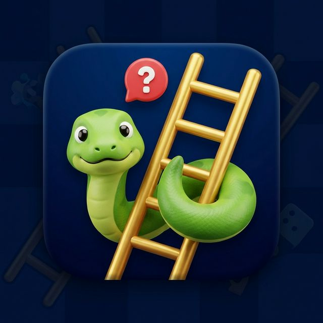

<div align="center">
  
  
  # 🎮 Ular Tangga Seru
  
  **Permainan Ular Tangga interaktif yang dibangun dengan React, TypeScript, dan Vite**
  
  [](https://ular-tangga-seru.vercel.app/)
  [](https://firebase.google.com/)
  [](https://reactjs.org/)
  [](https://www.typescriptlang.org/)
  [](https://vitejs.dev/)
  
  ### 🚀 [Live Demo](https://ular-tangga-seru.vercel.app/) | [Documentation](#) | [Report Bug](#)
  
</div>

---

## 🎲 Tentang Ular Tangga Seru

Ular Tangga Seru adalah permainan klasik ular tangga yang dibawa ke era digital dengan tampilan modern dan fitur interaktif. Nikmati pengalaman bermain yang seru bersama teman atau keluarga!

## 📸 Screenshots

> 💡 **Coba langsung:** [https://ular-tangga-seru.vercel.app/](https://ular-tangga-seru.vercel.app/)

<div align="center">

### 🏠 Halaman Utama

*Tampilan halaman utama dengan menu permainan*

### 🎯 Gameplay

*Papan permainan ular tangga yang interaktif*

### 🏆 Leaderboard

*Sistem peringkat pemain terbaik*

### 📱 Responsive Design


*Optimal di semua perangkat*

</div>

---

## ✨ Fitur Utama

- 🎲 **Papan Permainan Interaktif** - Animasi yang smooth dan menarik
- 👥 **Multiplayer Mode** - Main bersama teman (2-4 pemain)
- 🏆 **Leaderboard System** - Catat skor tertinggi Anda
- 🎨 **UI/UX Modern** - Desain colorful dan user-friendly
- 📱 **Fully Responsive** - Main di HP, tablet, atau desktop
- 🔥 **Real-time Updates** - Sinkronisasi data dengan Firebase
- 🎵 **Sound Effects** - Efek suara yang menyenangkan
- 💾 **Auto Save** - Progress tersimpan otomatis

## 🎮 Cara Bermain

1. **Akses game** di [ular-tangga-seru.vercel.app](https://ular-tangga-seru.vercel.app/)
2. **Masukkan nama pemain** (2-4 pemain)
3. **Klik dadu** untuk melempar
4. **Ikuti aturan**:
   - 🪜 Tangga = naik ke atas
   - 🐍 Ular = turun ke bawah
   - 🎯 Pertama sampai kotak 100 = MENANG!

## 🛠️ Teknologi

| Teknologi | Kegunaan |
|-----------|----------|
| **React** | Library UI untuk membangun interface |
| **TypeScript** | Type safety untuk kode yang robust |
| **Vite** | Build tool super cepat |
| **Firebase** | Backend & Real-time Database |
| **Firestore** | Menyimpan data pemain & skor |
| **Vercel** | Hosting & deployment |
| **ESLint** | Code quality & linting |

## 🚀 Quick Start

### Prerequisites

- Node.js (v16+)
- npm atau yarn
- Git

### Development Setup

```bash
# Clone repository
git clone https://github.com/revanapriyandi/Games.git
cd Games

# Install dependencies
npm install

# Setup environment variables
cp .env.example .env
# Edit .env dengan Firebase config Anda

# Run development server
npm run dev

# Buka http://localhost:5173
```

### Build untuk Production

```bash
# Build aplikasi
npm run build

# Preview production build
npm run preview

# Deploy ke Vercel (opsional)
vercel
```

## 📦 Scripts

| Command | Deskripsi |
|---------|-----------|
| `npm run dev` | Jalankan development server |
| `npm run build` | Build untuk production |
| `npm run preview` | Preview production build |
| `npm run lint` | Check code quality |

## 🔥 Firebase Configuration

1. Buat project di [Firebase Console](https://console.firebase.google.com/)
2. Enable **Firestore Database**
3. Enable **Authentication** (Email/Password atau Google)
4. Copy konfigurasi ke `.env`:

```env
VITE_FIREBASE_API_KEY=your_api_key
VITE_FIREBASE_AUTH_DOMAIN=your_auth_domain
VITE_FIREBASE_PROJECT_ID=your_project_id
VITE_FIREBASE_STORAGE_BUCKET=your_storage_bucket
VITE_FIREBASE_MESSAGING_SENDER_ID=your_sender_id
VITE_FIREBASE_APP_ID=your_app_id
```

## 📁 Struktur Project

```
Games/
├── 📂 public/
│   ├── logo.png
│   ├── screenshots/
│   └── assets/
├── 📂 src/
│   ├── 📂 components/
│   │   ├── Board.tsx       # Komponen papan permainan
│   │   ├── Dice.tsx        # Komponen dadu
│   │   ├── Player.tsx      # Komponen pemain
│   │   └── ...
│   ├── 📂 pages/
│   │   ├── Home.tsx
│   │   ├── Game.tsx
│   │   └── Leaderboard.tsx
│   ├── 📂 services/
│   │   └── firebase.ts     # Firebase config
│   ├── 📂 hooks/
│   ├── 📂 utils/
│   └── App.tsx
├── firebase.json
├── firestore.rules
├── vite.config.ts
└── package.json
```

## 🎯 Roadmap

- [x] Papan permainan dasar
- [x] Multiplayer support
- [x] Firebase integration
- [x] Deployment ke Vercel
- [ ] Mode single player vs AI
- [ ] Custom themes
- [ ] Sound effects & music
- [ ] Achievements & badges
- [ ] Room system untuk multiplayer online
- [ ] Chat antar pemain
- [ ] Tournament mode

## 🐛 Known Issues

Temukan bug? [Laporkan di sini](https://github.com/revanapriyandi/Games/issues)

## 🤝 Contributing

Contributions are welcome! 

1. Fork repository
2. Create feature branch (`git checkout -b feature/AmazingFeature`)
3. Commit changes (`git commit -m 'Add AmazingFeature'`)
4. Push to branch (`git push origin feature/AmazingFeature`)
5. Open Pull Request

## 📄 License

MIT License - lihat [LICENSE](LICENSE) untuk detail.

## 👤 Author

**Revan Apriyandi**

- GitHub: [@revanapriyandi](https://github.com/revanapriyandi)
- Website: [ular-tangga-seru.vercel.app](https://ular-tangga-seru.vercel.app/)

## ⭐ Support

Jika project ini bermanfaat, jangan lupa kasih ⭐ ya!

---

<div align="center">
  
**Dibuat dengan ❤️ menggunakan React + TypeScript + Vite**

[🎮 Main Sekarang](https://ular-tangga-seru.vercel.app/) • [📖 Dokumentasi](#) • [🐛 Report Bug](https://github.com/revanapriyandi/Games/issues)

</div>
