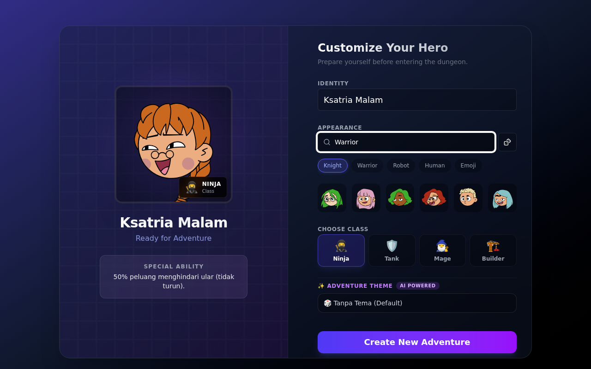
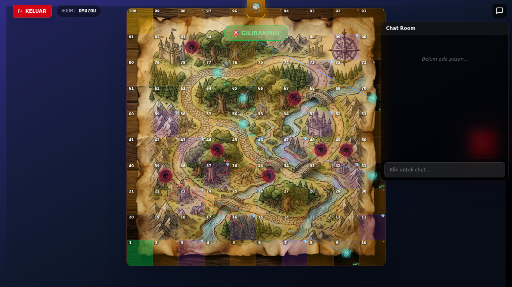

# 🎲 AI Board Game Adventure

<div align="center">

[](https://react.dev/)
[](https://www.typescriptlang.org/)
[](https://firebase.google.com/)
[](https://vitejs.dev/)
[](LICENSE)

A real-time multiplayer board game powered by React, Firebase, and AI. Navigate snakes, ladders, challenges, and card battles with your friends!

[Features](#-features) • [Roadmap](#-roadmap) • [Tech Stack](#-tech-stack) • [Installation](#-installation) • [Usage](#-usage)

</div>

---

## 📸 Screenshots

### Modern Lobby & Avatar Selector


### Gameplay


---

## ✨ Features

### 🎮 Gameplay
- **Classic Snakes & Ladders** with a modern twist
- **Real-time Multiplayer** - Play with friends in sync via Firebase
- **AI-Powered Challenges** - Dynamic challenges generated by Google Gemini
- **Card Battle System** - Strategic card battles during gameplay
- **Smooth Animations** - Powered by Framer Motion

### 🎨 Customization
- **Avatar Selector** - Choose from multiple avatar styles (Adventurer, Robot, Emoji)
- **Custom Avatars** via [DiceBear](https://dicebear.com/)
- **Randomize & Search** for the perfect avatar
- **Dark Modern UI** with glassmorphism effects

### 🔧 Technical Features
- **TypeScript** for type safety
- **Responsive Design** with Tailwind CSS
- **Real-time Database** synchronization
- **Fast Development** with Vite HMR

---

## 🎯 What's New (v2.0)

### 🎨 Modern Lobby & Avatar Selector
- **Custom Avatars:** Choose your unique look using the new **Avatar Selector**, powered by [DiceBear](https://dicebear.com/).
  - Search for your hero name to generate a unique avatar seed.
  - Randomize to find something that fits your style.
  - Supports multiple styles including Adventurer, Robot, and Emoji.
- **Sleek UI:** A completely redesigned lobby with a dark, modern aesthetic, glassmorphism effects, and smoother animations using Framer Motion.

### 🐛 Gameplay Improvements & Fixes
- **Double Dice Fix:** The "Double Dice" effect now correctly displays the halved value on the dice (e.g., rolling a 12 shows a 6) with a "x2" indicator, matching the movement logic.
- **Exit Button:** Restored the missing "KELUAR" (Exit) button in the game header, allowing players to leave the room easily.
- **Smoother Movement:** Character movement animations have been refactored to better handle Snakes & Ladders, preventing "backward walking" visual glitches.

---

## 🗺️ Roadmap

### ✅ Completed (v2.0)
- Modern lobby & avatar selector system
- AI-powered challenges dengan Google Gemini
- Card battle system
- Real-time multiplayer via Firebase
- Smooth animations dengan Framer Motion
- Responsive dark UI dengan glassmorphism

### 🚧 In Progress
- Performance optimization
- Mobile touch controls enhancement
- Bug fixes dan stability improvements

### 📅 Planned Features

#### v3.0 - Enhanced Gameplay (Q2 2026)
- [ ] Power-ups dan special items
- [ ] Achievement system
- [ ] Player statistics dan leaderboard
- [ ] Sound effects dan background music
- [ ] Tournament mode

#### v4.0 - Social Features (Q3 2026)
- [ ] Friend system
- [ ] Chat dalam game
- [ ] Spectator mode
- [ ] Replay system
- [ ] Custom board themes

#### v5.0 - Advanced Features (Q4 2026)
- [ ] Custom board editor
- [ ] AI opponent (single player mode)
- [ ] Mobile app (React Native)
- [ ] Multiple game modes
- [ ] Internationalization (i18n)

### 💡 Future Considerations
- VR/AR support
- NFT integration untuk custom avatars
- Tournament dan esports features
- Streaming integration
- Cross-platform play

---

## 🚀 Tech Stack

| Category | Technologies |
|----------|-------------|
| **Frontend** | React 19, TypeScript, Vite |
| **Styling** | Tailwind CSS 4, Framer Motion |
| **Backend** | Firebase Realtime Database |
| **AI** | Google Gemini API |
| **UI Components** | Radix UI, Lucide Icons |
| **Dev Tools** | ESLint, TypeScript ESLint |

---

## 📋 Prerequisites

Before you begin, ensure you have the following installed:
- **Node.js** (v18 or higher)
- **npm** (v9 or higher)
- **Git**

You'll also need:
- A **Firebase project** ([Create one here](https://console.firebase.google.com/))
- A **Google Gemini API key** ([Get one here](https://aistudio.google.com/apikey))

---

## 🛠️ Installation

### 1. Clone the Repository
```bash
git clone https://github.com/revanapriyandi/Games.git
cd Games
```

### 2. Install Dependencies
```bash
pm install
```

### 3. Configure Environment Variables
Create a `.env` file in the root directory:
```bash
cp .env.example .env
```

Edit `.env` and add your API keys:
```env
# Gemini AI API Key (get from https://aistudio.google.com/apikey)
VITE_GEMINI_API_KEY=your_gemini_api_key_here
```

### 4. Configure Firebase
1. Go to [Firebase Console](https://console.firebase.google.com/)
2. Create a new project or select an existing one
3. Enable **Realtime Database**
4. Copy your Firebase configuration
5. Update your Firebase config in `src/firebase.ts` (or wherever your config is located)

### 5. Start Development Server
```bash
npm run dev
```

The app should now be running at `http://localhost:5173` 🎉

---

## 🎮 Usage

### Available Scripts

| Command | Description |
|---------|-------------|
| `npm run dev` | Start development server with hot reload |
| `npm run build` | Build for production |
| `npm run preview` | Preview production build locally |
| `npm run lint` | Run ESLint to check code quality |

### How to Play

1. **Create/Join a Room** - Enter a room code or create a new one
2. **Choose Your Avatar** - Use the avatar selector to customize your character
3. **Wait for Players** - Wait for friends to join (2-4 players recommended)
4. **Roll the Dice** - Take turns rolling and moving across the board
5. **Face Challenges** - Complete AI-generated challenges and card battles
6. **Reach the End** - First player to reach square 100 wins!

---

## 📁 Project Structure

```
Games/
├── public/
│   └── screenshots/        # Game screenshots
├── src/
│   ├── components/         # React components
│   ├── firebase.ts         # Firebase configuration
│   └── ...
├── .env.example            # Environment variables template
├── firebase.json           # Firebase hosting config
├── package.json            # Dependencies and scripts
├── tsconfig.json           # TypeScript configuration
├── vite.config.ts          # Vite configuration
└── README.md              # You are here!
```

---

## 🤝 Contributing

Contributions, issues, and feature requests are welcome!

1. Fork the project
2. Create your feature branch (`git checkout -b feature/AmazingFeature`)
3. Commit your changes (`git commit -m 'Add some AmazingFeature'`)
4. Push to the branch (`git push origin feature/AmazingFeature`)
5. Open a Pull Request

---

## 📝 License

This project is licensed under the **MIT License** - see the [LICENSE](LICENSE) file for details.

---

## 👨‍💻 Author

**Revana Priyandi**
- GitHub: [@revanapriyandi](https://github.com/revanapriyandi)

---

<div align="center">

Made with ❤️ and ☕

**[⬆ back to top](#-ai-board-game-adventure)**

</div>